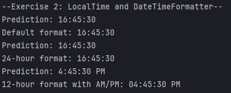
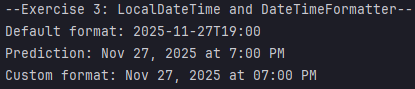
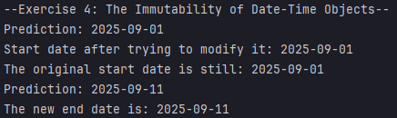
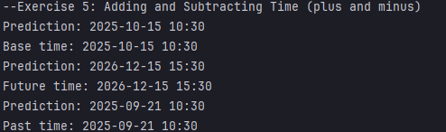
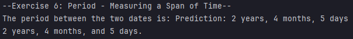

# Hands-on Lab: Working with Java's Date and Time API
## Jaime Luis Manalo
### Exercise 1: LocalDate and DateTimeFormatter

### Exercise 2: LocalTime and DateTimeFormatter

### Exercise 3: LocalDateTime and DateTimeFormatter

### Exercise 4: The Immutability of Date-Time Objects

### Exercise 5: Adding and Subtracting Time (plus and minus)

### Exercise 6: Period - Measuring a Span of Time

